Traffic Camera Violations in Chicago
========================================================
author: Brian Detweiler
date: April 24, 2017
autosize: true

The Data
========================================================

Interactive map: <http://bdetweiler.github.io/projects/chicago-traffic-cameras.html>

- City of Chicago traffic camera data: <https://data.cityofchicago.org/Transportation/Speed-Camera-Violations/hhkd-xvj4/>
- 150 cameras in the dataset
- Data range from 2014-07-01 to 2017-03-11

|     ADDRESS     | CAMERA.ID | VIOLATION.DATE | VIOLATIONS |
|:---------------:|:---------:|:--------------:|:----------:|
| 7738 S WESTERN  |  CHI065   |   2014-07-08   |     65     |
| 1111 N HUMBOLDT |  CHI010   |   2014-07-16   |     56     |
| 5520 S WESTERN  |  CHI069   |   2014-07-08   |     10     |
| 1111 N HUMBOLDT |  CHI010   |   2014-07-26   |    101     |
| 1111 N HUMBOLDT |  CHI010   |   2014-07-27   |     92     |
***
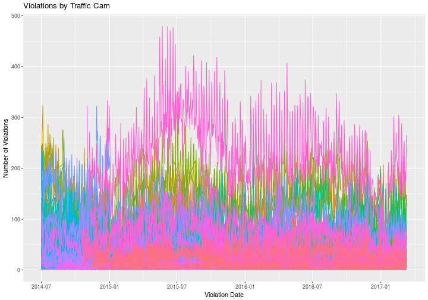

City-Level Data
========================================================

- Aggregate violations by date
- High level summary view of all violations in Chicago as Time Series

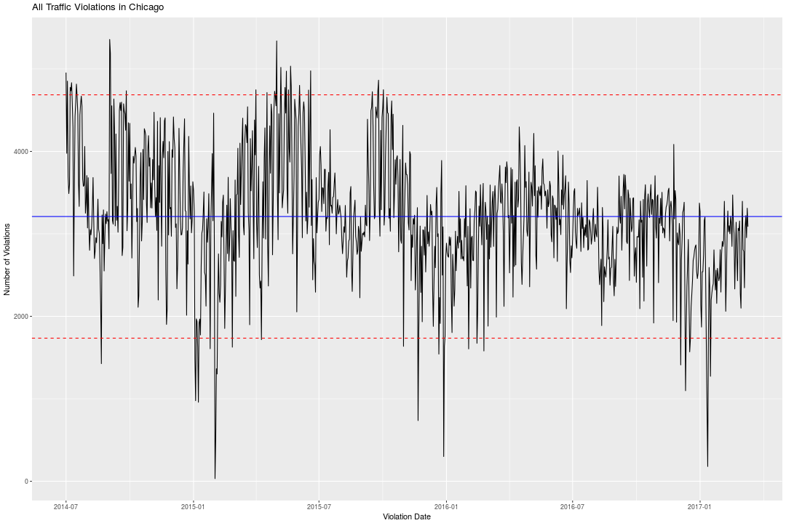

Stationarity of First Difference
========================================================

- $\nabla Y_t$ results in constant mean over time
- Variance still quite large, and heteroskedastic in some places

- Augmented Dickey-Fuller test p-value $< 0.01$

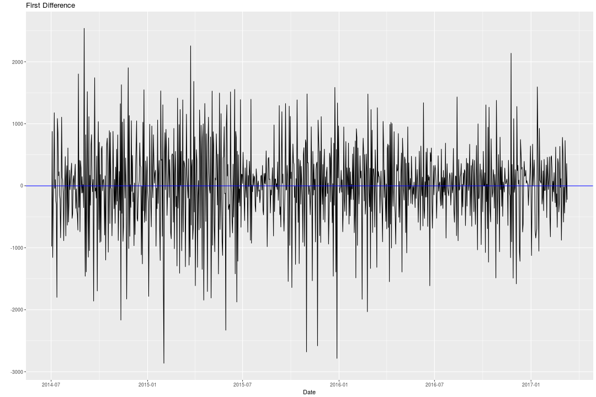

ACF and PACF of First Difference
========================================================
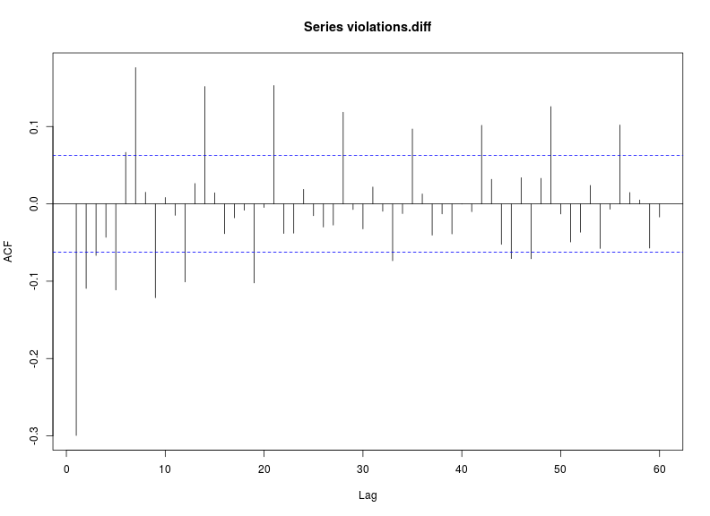
- ACF is problematic, and appears to have some seasonal influences at $7t$

***

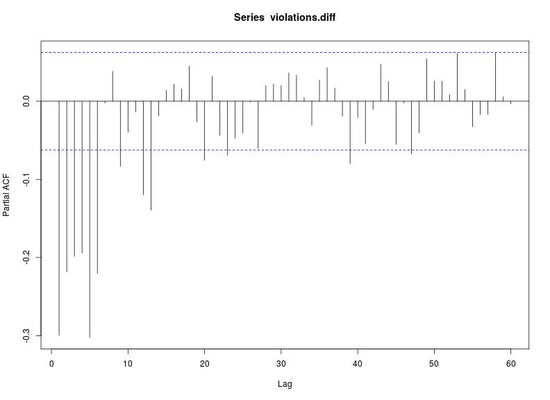
- PACF is also problematic
- Difficult to pick a model based on these

arma.subsets()
========================================================

Suggests an ARIMA(7, 1, 10) given by the equation
$$
\begin{split}
  W_t &= \nabla Y_t = Y_t - Y_{t - 1} \\
  W_t &= \phi_1 W_{t - 1} + \phi_7 W_{t - 7} + e_t - \theta_{1} e_{1} - \theta_6 e_{t - 6} - \theta_7 e_{t - 7} - \theta_8 e_{t - 8} - \theta_{10} e_{t - 10} \\
\end{split}
$$

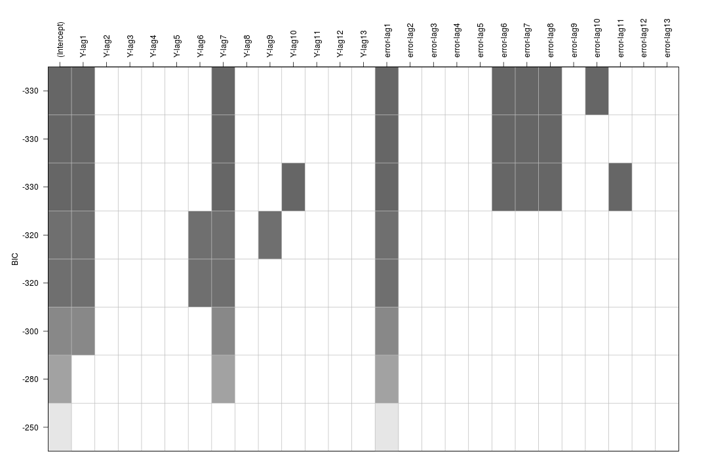

Model Diagnostics
========================================================

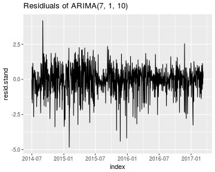
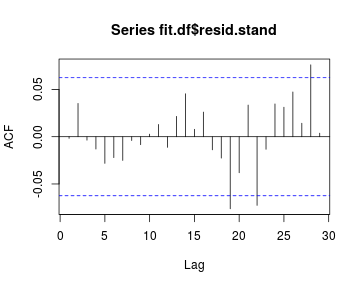

- AIC: 15246.82

***

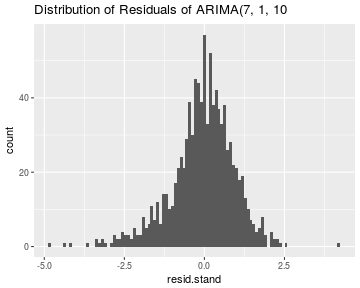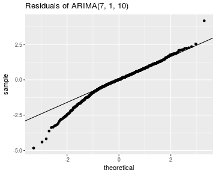

- Shapiro-Wilk test p-value  << 0.001
- Ljung-Box test p-value > 0.95 
  - Indepenent

Forecast
========================================================
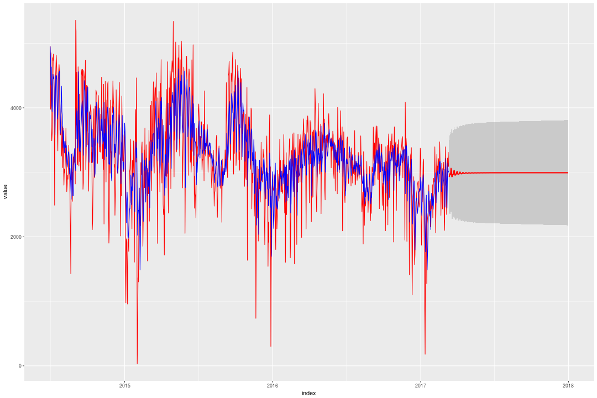

auto.arima()
========================================================

Suggests an ARIMA(1, 1, 3) given by the equation
$$
\begin{split}
  W_t &= \nabla Y_t = Y_t - Y_{t - 1} \\
  W_t &= \phi_1 W_{t - 1} + e_t - \theta_{1} e_{1} - \theta_2 e_{t - 2} - \theta_3 e_{t - 3} \\
\end{split}
$$

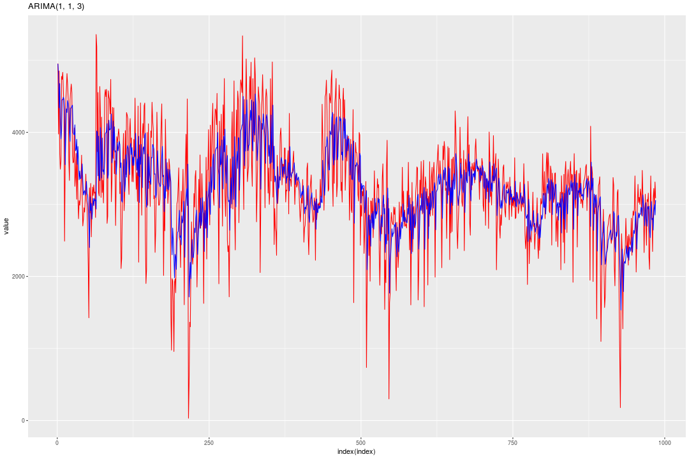

Model Diagnostics
========================================================

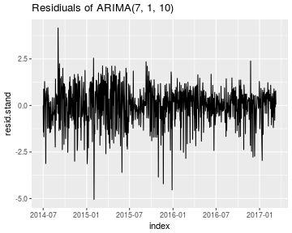

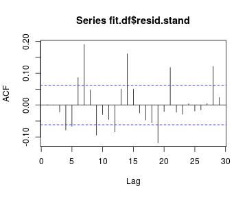

- AIC: 15331.86

***

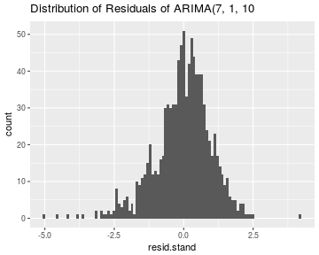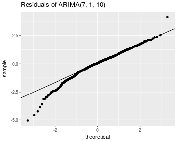

- Shapiro-Wilk test p-value  << 0.001
- Ljung-Box test p-value > 0.95 
  - Indepenent

Forecast
========================================================
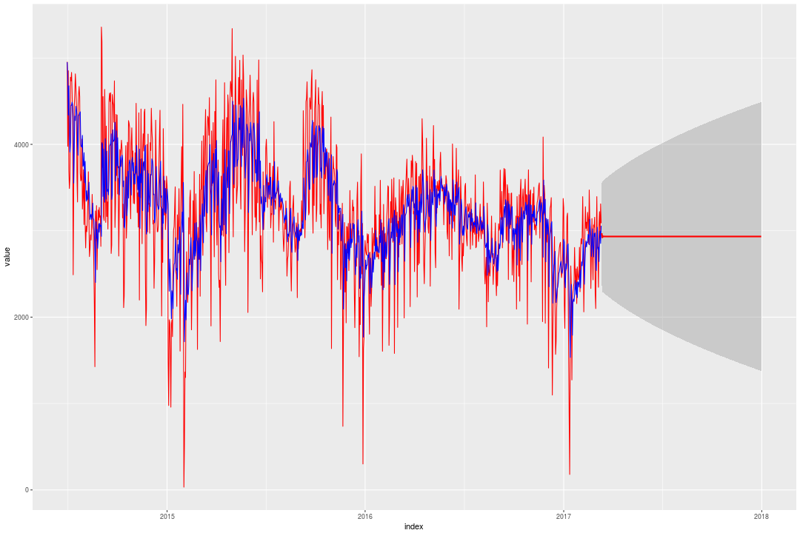

Conclusion
========================================================

- Data difficult to fit due to high day-to-day variance
- Addative Outliers present possibly due to weather (snow)
- Both models have i.i.d. normal residuals - Model 2 contains autocorrelation
- Model 1 has lower AIC
- Model 2 has more realistic prediction limits
